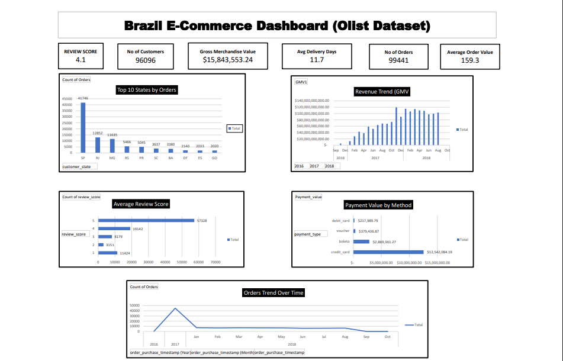

# 📊 Brazil E-Commerce Dashboard (Olist Dataset)

## 📌 Project Overview
This project analyzes the Brazilian e-commerce dataset from Olist using Excel.  
It focuses on orders, revenue, customer behavior, delivery performance, and payment insights.  

## 🔑 Key Features
- KPI summary (Orders, Customers, GMV, Avg Order Value, Avg Review Score)
- Trend analysis: Orders & Revenue over time
- Delivery performance: Late Deliveries % trend
- Customer insights: Top 10 states by orders
- Payment analysis: Value by payment method

## 📷 Dashboard Preview

## 📂 Dataset
The dataset is from [Olist E-Commerce Dataset on Kaggle](https://www.kaggle.com/datasets/olistbr/brazilian-ecommerce).

## ⚙️ Tools Used
- Microsoft Excel (PivotTables, Power Query, Power Pivot, DAX)
- Data modeling

---
